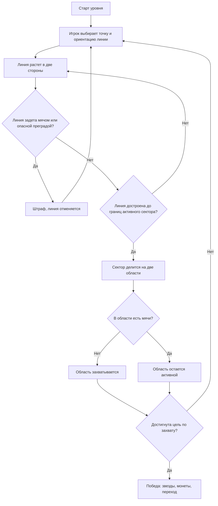

# Кодекс JezzBall

## Исполнительное резюме

По состоянию на 10 мая 2026 года мне не удалось найти публичную карточку или внешние промоматериалы именно для вашего билда: в поиске находятся общий каталог urlЯндекс Игрturn0search0 и страницы про классическую JezzBall/её клоны, но не страница с вашим слоганом, главами или текущим chapter-based UI. Поэтому этот файл нужно читать как гибрид: **подтверждено по вашему прототипу + подтверждено по классической игре + предложено как production-спека там, где публичных материалов нет**. Формально документ опирается на текущие исходники, актуальную urlдокументацию SDK платформыturn2search0 и urlтребования платформыturn2search1. citeturn1search3turn1search4turn5search0turn6view2turn6view1 fileciteturn0file0 fileciteturn0file1 fileciteturn0file2

Что уже ясно по исходникам: игра называется **JezzBall**, открывается стартовым экраном со слоганом «Проведи линию. Захвати пространство.», имеет экран выбора глав, отдельный экран уровня, экран финала, модальное окно настроек и окно подтверждения; навигация рассчитана на **10 глав по 10 уровней**, но уникальные игровые конфиги сейчас описаны только для уровней **1–10**, а магазин и достижения присутствуют как UI-кнопки без рабочей логики. В прототипе уже есть монеты, жизни, звезды, сохранение прогресса, три языка интерфейса и базовая интеграция SDK платформы. fileciteturn0file0 fileciteturn0file1 fileciteturn0file2

По геймплейному ядру проект — современная chapter-based интерпретация классической entity["video_game","JezzBall","1992 video game"]: игрок ставит вертикальные или горизонтальные линии, делит поле, «отрезает» пустые зоны и старается дойти до целевого процента захвата, пока по активной части поля движутся мячи. Классическая игра исторически строилась вокруг той же идеи, а в вашем прототипе она уже перенесена на canvas с собственным визуальным стилем и мягкой мобильной мета-экономикой. citeturn5search0turn6view0turn1search3 fileciteturn0file1

| Блок | Что уже подтверждено | Что считать production-решением |
|---|---|---|
| Название и идентичность | **JezzBall**, яркий слоган про линию и захват пространства | Сохранять название и high-concept без переупаковки |
| Целевая платформа | HTML5-проект с интеграцией SDK платформы | Публиковать как казуальную аркадную головоломку под мобильный и десктоп |
| Структура кампании | 10 глав × 10 уровней в UI и прогрессии | Заполнить уникальными конфигами все 100 уровней |
| Реально настроенные уровни | Уникально описаны только 1–10; дальше код откатывается к дефолту уровня 1 | Срочно завести `LEVEL_CONFIGS` для уровней 11–100 |
| Экономика | Монеты, жизни, звезды уже есть | Магазин и достижения надо либо реализовать, либо убрать из UI до публикации |
| Сохранения | Сейчас — `localStorage` | Для релиза использовать облачные данные игрока; для своего домена учесть safe storage |
| Интеграция SDK | Есть `YaGames.init()`, `environment.i18n.lang`, `LoadingAPI.ready()` | Добавить cloud save, рекламу, покупки и, по возможности, gameplay markers |
| Локализация | Есть словари RU/EN/IT | Довести до 100% строк и не заявлять язык в черновике, пока он не переведен полностью |

Эта матрица следует прямо из HTML/CSS/JS прототипа и из актуальных требований платформы. fileciteturn0file0 fileciteturn0file1 fileciteturn0file2 citeturn7view1turn11view3turn16search0turn15search5

## Подтвержденная база проекта

Нужно отдельно зафиксировать два технических разрыва. Первый: в `index.html` подключён SDK-скрипт по адресу, который не совпадает с путём, рекомендованным актуальной документацией; перед публикацией подключение нужно перевести на документированный вариант. Второй: локализация в целом заведена правильно через `environment.i18n.lang`, но диалог перепрохождения уровня внутри `openLevel()` всё ещё жёстко зашит русскими строками, что ломает полную i18n-консистентность. fileciteturn0file0 fileciteturn0file1 citeturn6view2turn16search0turn16search3

С точки зрения codex это означает простое правило: **не изобретать новую игру, а довести уже существующий прототип до полного состояния**. Основная архитектура у вас уже правильная: отдельные state-экраны, адаптивный canvas, life-gating, звёздная прогрессия, глава как тематическая оболочка и короткие казуальные сессии. Самый сильный актив проекта — не отдельная «фича», а то, что визуальный и структурный каркас уже собран и узнаваем. fileciteturn0file0 fileciteturn0file1 fileciteturn0file2

Для codex полезно принять такую границу между фактами и проектными решениями: **название, chapter map, базовая физика, жизни, монеты, звезды, стилистика и первые 10 уровней — это канон; магазин, достижения, боевые конфиги 11–100, полноценная монетизация и облачные сохранения — это то, что нужно дописать, не ломая канон**. fileciteturn0file1

## Игровое ядро

### Что это за игра

Для codex игру стоит формулировать так: **односессионная аркадная головоломка на захват площади**, где каждая попытка длится от 20 до 90 секунд, игрок поочерёдно строит линии, уменьшает свободное пространство для мячей, избегает штрафов и закрывает уровень по достижении нужного процента захвата. Главная мета-петля: **уровень → звезды → монеты/жизни → следующая глава**. Это хорошо ложится на формат платформы: короткие экраны, понятный touch-first цикл и чёткие логические паузы между уровнями. citeturn5search0turn6view0turn8view0turn15search0 fileciteturn0file1

### Поток попытки

С точки зрения codex, базовая логика уровня должна быть такой:



Эта схема повторяет текущее поведение прототипа: линия растёт из точки в две стороны, при достройке делит **активный прямоугольник**, пустая половина становится `captured`, а половина с мячами остаётся в симуляции. fileciteturn0file1

### Управление, победа, поражение и счёт

В текущем прототипе управление уже хорошо разделено по устройствам: на touch/pen сначала показывается черновой превью-указатель, а построение подтверждается отпусканием; на desktop мышь ставит линию сразу, а ориентация берётся из направления движения курсора или из ближайшей оси относительно края. Это удачная база для codex, потому что она не требует отдельной кнопки «вертикально/горизонтально» и остаётся быстрой. fileciteturn0file1

Ключевая особенность вашего билда — **мягкое наказание вместо мгновенного поражения**. Сейчас попадание по строящейся линии не завершает уровень и не отнимает жизнь внутри попытки: оно просто даёт `penalty`, сбрасывает линию и ухудшает итоговую звёздность. Для платформенной казуальной версии это стоит сохранить как основной режим кампании. Хардкорный fail-state можно добавлять только как отдельный поздний модификатор, а не как базовое правило всей игры. fileciteturn0file1

Точные численные правила текущего прототипа уже заданы в коде. fileciteturn0file1

| Параметр | Текущее значение | Норма для codex |
|---|---:|---|
| Максимум жизней | 5 | Оставить |
| Восстановление жизни | 1 жизнь / 3 минуты | Оставить как базовую энергию |
| Скорость роста линии | 420 px/s | Оставить как feel target |
| Радиус мяча | 11 px | Оставить как базовый хитбокс |
| Толщина препятствия | 12 px | Оставить |
| Скорости мячей | 150 / 190 / 235 | Использовать как slow / medium / fast tiers |
| Базовый win-condition | 75–95% захвата | Эскалировать от 75% к 95% |
| Формула звёзд | 3★: цель + 0 штрафов; 2★: цель + 1 штраф; 1★: цель + 2+ штрафа | Оставить |
| Внутриуровневой проигрыш | Нет | Не добавлять в основной campaign loop |
| Макро-проигрыш | Нельзя начать попытку при 0 жизней | Оставить |

Для рейтинга и аналитики поверх текущих звёзд стоит добавить отдельный **score**, не влияющий на проходимость:

```text
LevelScore =
  floor(capturedPercent * 1000)
  + max(0, parTimeSec - elapsedSec) * 10
  + (noBoostUsed ? 250 : 0)
  - penalties * 150
```

Такой счёт не ломает текущую мягкую модель, но даёт понятный лидерборд и skill ceiling. Это уже проектное решение, а не то, что есть в билде сейчас.

### Мячи, стены и препятствия

Ниже — production-спека, которая сохраняет текущий feel и расширяет его до 100 уровней.

#### Мячи

| Тип мяча | Статус | Радиус | Скорость | Поведение | Где использовать |
|---|---|---:|---:|---|---|
| Базовый | Уже есть | 1.0x | 1.0x | Обычное отражение от границ, стен и опасных преград | Все главы |
| Быстрый | Предлагается | 0.9x | 1.25x | Быстрее закрывает траектории, наказывает за слишком длинные разрезы | Главы 3–10 |
| Тяжёлый | Предлагается | 1.2x | 0.85x | Более предсказуем, но имеет больший опасный радиус касания линии | Главы 5–10 |
| Пульсирующий | Предлагается | 1.0x | 1.0x → 1.4x импульсом | Каждые 4 сек. ускоряется на 1 сек.; ломает «безопасный ритм» игрока | Главы 8–10 |

#### Стены и преграды

| Объект | Статус | Как работает | Влияние на игрока | Влияние на мячи |
|---|---|---|---|---|
| Граница поля | Уже есть | Неподвижная рамка игрового прямоугольника | Точка привязки для завершения линии | Отражает |
| Строящаяся линия | Уже есть | Растёт из точки в две стороны по одной оси | Может быть сбита, даёт штраф | До достройки не отражает |
| Построенная стена | Уже есть | После достройки становится постоянной границей | Делит сектор на две области | Отражает |
| Захваченная область | Уже есть | Выключается из симуляции и окрашивается | Увеличивает % захвата | Мячи туда больше не попадают |
| Опасная преграда | Уже есть | Сплошная яркая/тёмная линия, статичная или движущаяся | Касание строящейся линией = штраф | Обычно отражает |
| Безопасная направляющая | Уже есть | Светлая пунктирная линия | По ней можно строить и задевать её | Не отражает |
| Плавающий барьер | Поддержка уже заложена | Прямоугольная moving obstacle | Сужает тайминги и коридоры | Отражает |

В коде уже реализованы: деление активного прямоугольника, список `activeRects`, список `capturedRects`, готовые стены, безопасные и опасные препятствия, а также синусоидальное движение moving obstacles по фазе и амплитуде. Это сильная база: codex не должен менять архитектуру, только масштабировать контент. fileciteturn0file1

## Главы и уровни

Главная системная проблема текущего прототипа проста: chapter map и прогресс рассчитаны на 100 уровней, но реальные `LEVEL_CONFIGS` есть только для первых десяти, поэтому уровни 11–100 сейчас не имеют собственной боевой сложности. Ниже — правильный способ превратить уже существующий скелет в полноценную кампанию. fileciteturn0file1

Сначала — точный снимок того, что уже настроено для уровней 1–10. fileciteturn0file1

| Уровень | Цель | Мячей | Скорость | Ядро угрозы |
|---|---:|---:|---|---|
| 1 | 75% | 1 | medium | Чистое поле, обучение |
| 2 | 75% | 1 | slow | Статичная опасная вертикаль |
| 3 | 80% | 2 | slow | Первый рост давления за счёт второго мяча |
| 4 | 80% | 2 | medium | Движущаяся опасная вертикаль |
| 5 | 85% | 2 | fast | Безопасная горизонтальная направляющая |
| 6 | 85% | 3 | medium | Статичная опасная горизонталь |
| 7 | 90% | 3 | fast | Движущаяся опасная горизонталь |
| 8 | 90% | 3 | fast | Статический крест из опасных преград |
| 9 | 95% | 4 | medium | Движущаяся опасная вертикаль и высокий target |
| 10 | 95% | 4 | fast | Смешанный финальный экзамен |

Это очень удачный **шаблон ролей 1–10**, и его выгодно использовать как матрицу внутри каждой главы: меняются тема, палитра, типы мячей и комбинация угроз, но роли уровней остаются читаемыми. fileciteturn0file1

### Полная структура кампании

Названия глав и их визуальная палитра уже определены вашими исходниками; ниже я сохраняю эти темы и добавляю production-роль каждой главе, а также по одному образцовому уровню. fileciteturn0file1 fileciteturn0file2

| Глава | Тема | Новая доминанта | Диапазон целей | Пример уровня |
|---|---|---|---:|---|
| Солнечная поляна | Тёплый свет, золотые поля, лёгкая магия | Обучение чистым разрезам | 75–80% | **Подсолнухи**: 1 базовый мяч, 1 вертикальный стебель, учим безопасный first cut |
| Таинственный лес | Корни, тени, узкие проходы | Статичные опасные линии и ложные коридоры | 78–82% | **Корни под ногами**: 2 мяча, 2 тёмных вертикали, игрок режет между ними |
| Хрустальные пещеры | Кристаллы, отражения, холодный свет | Безопасные направляющие и симметрия | 80–84% | **Кристальный мост**: safe guide по центру, цель — быстро изолировать верхний карман |
| Забытая башня | Механизмы, шахты, лифты | Первые moving barriers | 82–86% | **Лифтовая шахта**: движущаяся вертикальная створка + 2 мяча |
| Огненные вершины | Лава, жар, контраст золота и пурпура | Узкие горячие зоны и тяжёлый мяч | 84–88% | **Лавовый карниз**: 1 тяжёлый + 2 базовых шара, нижняя горизонталь ходит волной |
| Небесные острова | Облака, пустота, воздушные мосты | Длинные безопасные разрезы и разреженное поле | 85–89% | **Мост ветра**: safe guide через центр, игрок должен закрыть большой пустой сектор сверху |
| Огни города | Ночь, трафик, окна, неон | Параллельные движущиеся преграды | 87–91% | **Перекрёсток**: две moving lines в противофазе, 3 мяча |
| Неоновый ритм | Синтвейв, пульс, музыкальный ритм | Ритмические moving obstacles и пульсирующий мяч | 88–92% | **Синкопа**: 4 мяча, крест движется по X/Y со сдвигом фаз |
| Звёздный путь | Космос, холодный вакуум, длинные трассы | Высокая скорость и sparse layout | 90–94% | **Орбита**: 4 мяча, редкие преграды, ставка на длинный идеальный разрез |
| Врата света | Бело-золотой финал, очищение, кульминация | Смешанный экзамен на все механики | 92–95% | **Последний разрез**: 5 мячей, 3 moving barriers, одна safe guide для bait-решения |

Чтобы из 10 рабочих схем сделать 100 уровней, внутри **каждой главы** нужно использовать одну и ту же внутреннюю драматургию:

| Слот уровня внутри главы | Роль |
|---|---|
| 1 | Мягкое знакомство с новой темой главы |
| 2 | Первая статичная угроза |
| 3 | Рост давления за счёт второго или третьего мяча |
| 4 | Первое движение препятствия |
| 5 | Safe-guide или ложное чувство безопасности |
| 6 | Третий слой давления: больше шаров или tighter corridor |
| 7 | Движущаяся угроза по противоположной оси |
| 8 | Кросс-угрозы или двойная синхронизация |
| 9 | Предфинальный стресс-тест на скорость и контроль |
| 10 | Глава-босс: смешанный паттерн, максимальная цель и проверка mastery |

```mermaid
flowchart LR
    C1[Глава 1<br/>Солнечная поляна] --> C2[Глава 2<br/>Таинственный лес]
    C2 --> C3[Глава 3<br/>Хрустальные пещеры]
    C3 --> C4[Глава 4<br/>Забытая башня]
    C4 --> C5[Глава 5<br/>Огненные вершины]
    C5 --> C6[Глава 6<br/>Небесные острова]
    C6 --> C7[Глава 7<br/>Огни города]
    C7 --> C8[Глава 8<br/>Неоновый ритм]
    C8 --> C9[Глава 9<br/>Звёздный путь]
    C9 --> C10[Глава 10<br/>Врата света]
    C10 --> F[Финал]
```



Текущая логика разблокировки уже соответствует этой схеме: следующий уровень открывается линейно, следующая глава становится релевантной после закрытия десяти уровней предыдущей, а после 100-го уровня открывается финальный экран. fileciteturn0file1

По балансу кампанию лучше разбивать на четыре пояса сложности: **обучение** (главы 1–2), **освоение ритма** (главы 3–5), **давление и плотность решений** (главы 6–8), **экзамен на точность** (главы 9–10). Это даст ровную кривую без скачка «слишком легко → слишком жёстко».

## Экономика, магазин и бусты

Подтверждено по текущей версии: у вас уже есть монеты, жизни, звёзды, таймер восстановления жизней, награды за прохождение уровня и экран post-level rewards. Награда по звёздам определена жёстко, а специальная таблица наград сейчас заведена только для уровней 1–10; для остальных уровней код откатывается к более простой fallback-награде. Отдельного магазина, каталога предметов, экрана достижений, покупок или rewarded flow пока нет. fileciteturn0file0 fileciteturn0file1

В fallback-экономике за 1/2/3★ уже заложены **80/120/180 монет**, а 3★ дополнительно может вернуть жизнь; для уровней 1–10 действует отдельная escalating-таблица наград. Поскольку жизнь тратится уже на вход в уровень, магазин в этой игре должен прежде всего смягчать friction рестартов, а не продавать игроку грубую «силу». fileciteturn0file1

Для production-codex рекомендую держать экономику в трёх слоях: **звёзды** как показатель мастерства, **монеты** как мягкая валюта комфорта, **портальная валюта/SDK purchase** только для convenience-офферов и отключения рекламы. Если вводятся IAP, используемые покупки нужно консумировать, необработанные покупки — проверять на старте, а каталог и цены — тянуть через SDK. citeturn10view0turn10view1turn10view2turn8view2

### Предлагаемый магазин мягкой валюты

| Предмет | Эффект | Статы | Цена | Зачем нужен |
|---|---|---|---:|---|
| Подсказка разреза | Показывает лучший безопасный сектор | 6 сек., 1 использование | 120 | Снижает фрустрацию на ранних главах |
| Турбо-стена | Ускоряет следующий разрез | +60% к росту линии на 1 линию | 180 | Помогает на тесных движущихся уровнях |
| Щит строителя | Смягчает первую ошибку | Первое попадание по линии просто отменяет её без штрафа | 220 | Даёт страховку без pay-to-win |
| Замедление | Делает тайминги читаемее | -35% к скорости всех мячей на 8 сек. | 260 | Хорошо работает в середине кампании |
| Заморозка | Полная пауза угроз | 3 сек. стоп всех мячей | 400 | Редкий panic-button для поздней игры |
| Рестарт без энергии | Перезапуск уровня без траты жизни | 1 уровень, мгновенно | 300 | Снимает боль от энергии |
| Дополнительная жизнь | Восстанавливает 1 жизнь | +1 immediately | 500 | Экономический sink и понятный utility |
| Антиштраф | Списывает 1 накопленный штраф в текущем уровне | −1 penalty | 180 | Позволяет бороться за 3★ после ошибки |

### Предлагаемые SDK-покупки

| Товар | Тип | Состав | Цена в портальной валюте | Назначение |
|---|---|---|---:|---|
| Отключить рекламу | Постоянная | Убирает interstitial, rewarded остаётся добровольным | 1 permanent SKU | Главный premium comfort offer |
| Стартовый набор | Используемая покупка | 1000 монет + 3 щита + 3 замедления | low tier | Мягкий вход в мету |
| Набор мастера | Используемая покупка | 2500 монет + 5 заморозок + 5 рестартов без энергии | mid tier | Для late-game игроков |
| Косметический пак глав | Постоянная | Альтернативные рамки HUD и скины следа линии | low-mid tier | Монетизация без влияния на баланс |

По рекламе логика должна быть очень строгой: для коротких уровней межстраничку лучше показывать **между уровнями**, после явного пользовательского действия, а rewarded — только по желанию игрока и с прозрачной наградой. Внутри короткого активного уровня interstitial ставить нельзя; если когда-нибудь появятся длинные режимы, игра обязана ставиться на паузу до и во время показа. citeturn15search0turn12search0turn9search0

## Визуальный стиль, техническая спецификация и QA

По CSS и HTML визуальная идентичность уже очень сильная и её нужно не ломать, а дисциплинировать: глубокий фиолетовый фон, контрастные pink/cyan/gold градиенты, glassmorphism-панели, pill-кнопки, плотный glow, крупная rounded UI-типографика и отдельные фоновые арты для каждой главы в landscape и portrait. UI уже использует safe-area insets, отключение системного скролла, touch-action control, отдельные state-экраны и единый набор resource pills. Именно это и нужно считать каноном стиля. fileciteturn0file0 fileciteturn0file2

### Стайлгайд для codex

| Слой | Правило |
|---|---|
| Фоны | У каждой главы своя пара background art: landscape + portrait |
| Палитра | Общая база: violet/navy; акценты глав — pink, cyan, gold, peach, electric blue |
| Игровое поле | Тёмный board c мягкой сеткой точек, светлая рамка, золотые captured areas |
| Мячи | Светящиеся сферы с белым бликом и cyan/blue core; новые типы отличаются оттенком и хвостом, но не стилем |
| Линия игрока | Жёлто-cyan-magenta gradient beam с сильным glow |
| Препятствия | Опасные — сплошные яркие/тёмные линии; безопасные — светлый dashed |
| UI | Скругление 8 px у карточек и 999 px у pill-элементов; прозрачные панели с blur |
| Типографика | Inter или другой rounded sans, очень жирные заголовки, короткие живые фразы |

### Набор обязательных ассетов

| Пакет | Минимум |
|---|---|
| Главы | 10 landscape bg + 10 portrait bg |
| Меню и финал | 2 background art + 1 финальный key visual |
| UI | 12–16 иконок: play, back, settings, coin, life, star, shop, achievements, replay, next, close |
| Игровые FX | 4 скина мяча, 3 материала линии, 3 материала obstacles, capture overlay |
| Награды | Спрайты coin, heart, star, SDK currency placeholders |
| Звук | 1 menu loop, 10 chapter loops или 4 mood-loops, 10–14 SFX |
| Тексты | Полный string-table для RU/EN/IT или только для реально заявленных языков |

### Техническая спецификация для платформы

Таблица ниже сводит production-требования, которые особенно важны именно для этой игры. Она основана на официальных требованиях и SDK-доках, а также на состоянии текущего билда. citeturn6view2turn7view1turn7view0turn8view0turn8view1turn8view2turn8view3turn11view0turn11view3turn12search0turn16search0turn15search5 fileciteturn0file0 fileciteturn0file1 fileciteturn0file2

| Точка | Что требует production | Статус прототипа | Решение |
|---|---|---|---|
| Подключение SDK | Использовать документированный способ подключения | Нужна правка пути скрипта | Переключить на официальный path перед релизом |
| Game Ready | Вызывать только когда всё реально готово и нет loader-screen | Уже есть `LoadingAPI.ready()` | Оставить |
| Gameplay markers | Старт/стоп геймплея на уровне, в меню, при рекламе, при победе или проигрыше | Нет | Добавить `GameplayAPI.start/stop()` |
| Сохранения | Прогресс должен сохраняться сразу; для кросс-девайса — cloud/player data | Сейчас только localStorage | Для релиза подключить Player data; если свой домен — safe storage на iOS |
| Локализация | Автоопределение языка через SDK на старте и 100% перевод заявленных языков | Основа есть, но есть hardcoded RU-строки | Дочистить все диалоги и будущие shop/error строки |
| Кнопки и экраны | Никаких dead controls и «в процессе разработки» | Shop/achievements пока фактически пустые | Либо реализовать, либо скрыть |
| Контентная полнота | Игра должна быть завершённой | Сейчас реальный gameplay-контент = 10 уровней | Заполнить 11–100 до модерации |
| Реклама | Только через SDK и только в логических паузах | Не реализована | Interstitial между уровнями, rewarded добровольно |
| IAP | Только через SDK; used purchases — consume; pending purchases — recovery | Не реализовано | Проверка `getPurchases()` на старте и консумирование |
| Адаптивность | Никакого браузерного скролла, деформации, наложений, gesture bugs | В целом уже хорошо | Оставить и проверить все модалки и баннерные режимы |

### QA-чеклист

| Категория | Что обязательно проверить перед handoff в codex |
|---|---|
| Ввод | Мышь, touch, pen; быстрые тапы; длинные свайпы; отпускание пальца вне поля; pointer cancel |
| Ресайз | Поворот устройства; resize окна; восстановление после сворачивания; пересчёт active rects и wall mapping |
| Физика | Коллизии шара с новой стеной, опасной линией, moving obstacle; отсутствие «проскакивания» после tab resume |
| Прогресс | Сохранение после каждой звезды, монеты, жизни, открытия уровня, закрытия главы |
| Экономика | Нельзя уйти в минус по монетам/жизням; rewarded не дублируется; retry token расходуется ровно раз |
| Локализация | Ни одной hardcoded строки; все ошибки, тосты, названия бустов и модалки переведены |
| Реклама | Interstitial не появляется внутри короткого уровня; rewarded выдаёт награду только в `onRewarded` |
| Покупки | `getCatalog()`, `purchase()`, восстановление `getPurchases()`, `consumePurchase()` работают без дублей |
| UX | Ни одной неработающей кнопки; все модалки закрываются; нет тупиковых экранов |
| Модерация | Игра выглядит завершённой, без технических надписей, без внешних платежей и без конфликтов языка/черновика |

Итоговый приоритет для codex должен быть таким: **сначала довести до production уже существующее ядро и chapter-style, потом наполнить 100 уровней, потом подключить магазин, бусты и монетизацию, и только после этого делать polish-слои вроде лидербордов, оценки игры и расширенных достижений**. Такой порядок лучше всего соответствует и текущему состоянию билда, и требованиям платформы к завершённости, стабильности и логике показа рекламы. fileciteturn0file1 citeturn15search5turn8view3turn12search0